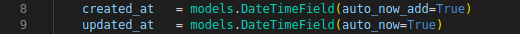

# 장고 테이블 추상화

장고 model을 통해 데이터베이스 테이블을 작성할 때 데이터의 보존기록이 필요하게 되면 아래와 같은 row를 추가하게 된다.



`created_at`은 데이터가 생성된 날짜, `updated_at`은 데이터가 수정된 날짜를 의미한다.

그렇다면 보존기록이 필요한 테이블이 매우 많다고 하면 해당 테이블마다 위의 row를 다 추가해주어야 될 수 있다는 말인데, 이를 간편하게 할 수 있는 방법이 있다. 해당 row를 가지고 있는 기반 클래스를 만들고 필요한 테이블이 상속을 받도록 하는 것이다.

```python
class TimeStampModel(models.Model):
    created_at  = models.DateTimeField(auto_now_add = True)
    updated_at = models.DateTimeField(auto_now = True)
    
    class Meta:
        abstract = True
    
class User(TimeStampModel) :
    ...
    
class Post(TimeStampModel) :
```

위와 같이 `TimeStampModel`클래스를 작성하고, User와 Post클래스를 만들 때 상속을 받게 만들면 자동으로 해당 인스턴스를 상속받아 포함하게 하여 반복되는 코드를 다 작성할 필요 없이 간단하게 구현이 가능하다.

그런데 사실상 TimeStampModel테이블이 필요하지 않음에도 생성될 수 있는데 이는 추상화 옵션을 통해 만들어 지지 않도록 할 수 있다. 위의 코드에 함깨 포함 되어있는데,

```python
class Meta:
    abstract = True
```

를 해주면 해당 클래스가 존재하지만 데이터베이스상에 테이블은 생성되지 않는다.
