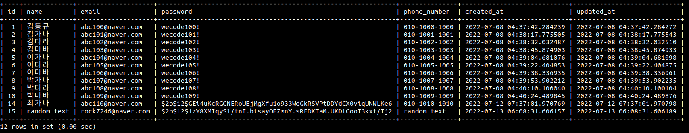

# Django 통신

클라이언트로 부터 직접 JSON 요청을 받아 회원가입과 로그인을 하는 통신을 해보았다.

기존에 서버를 가동시킬 때는 httpie를 이용하여 로컬호스트로 테스트를 해볼 때는 터미널에 아래와 같이 돌렸다.

`python manage.py runserver`

그런데 다른 클라이언트로 부터 통신을 할 때는 외부 접속을 허용하기 위해 다음과 같이 서버를 가동시켜야 한다.

`python manage.py runserver 0:8000`

서버를 가동시켰다면, 작성한 API에 연결시키기 위해 프론트엔드에 나의 `ip주소`와 url의 `end point`를 알려주어야 한다. 
우분투에서 ip주소를 확인하는 명령어는 `hostname -I`를 입력하면 ip주소를 반환해준다.

처음에 클라이언트 요청이 들어올 때는 `KEY_ERROR`가 발생하였는데, 원인을 원래 회원가입을 할 때는 이름, 이메일, 비밀번호, 휴대번호의 정보를 입력받도록 로직을 작성하였다. 
그런데 프론트에서 아직 회원가입 페이지를 구현하지 못해 로그인을 할 때, 회원가입과 로그인 작업이 동시에 되도록 짜여있던 것이였다. 
그래서 이름과 휴대번호 두 가지 필요한 키값이 전달되지 않아 에러가 발생한 것이였다. 그래서 해당 두 키값은 특정 텍스트가 들어가도록 작성하고 다시 통신을 시도하였다.

위 테이블에 id가 15인 값이 프론트와 통신을 통해 받은 데이터이다. 보면 name과 phone_numer column은 임의의 지정된 텍스트가 저장되고 이메일과 패스워드는 정상적으로 저장된 모습을 볼 수 있다.

이외에도 따로 캡처를 하지는 못했지만 잘못된 값을 입력했을 때 발생하는 에러 반환과 토큰 반환 모두 테스트해서 성공적으로 통신을 확인하였다.
