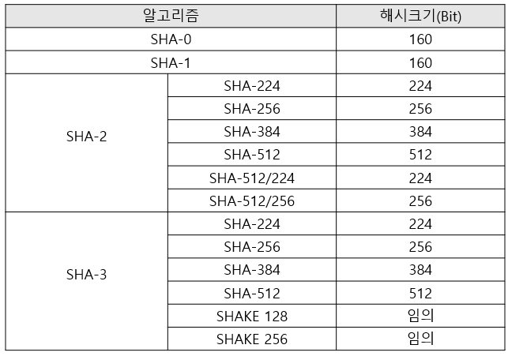
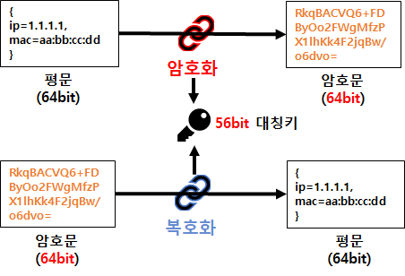
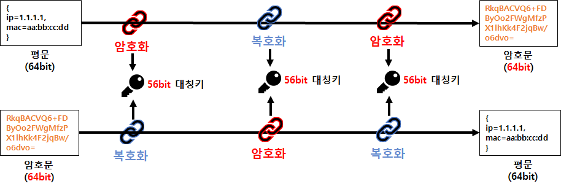
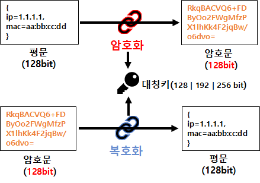

# 암호화

우리가 웹 페이지에서 로그인을 할 때, 아이디와 패스워드를 입력한다. 서버는 이를 DB(Database) 상에 저장된 사용자의 아이디와 패스워드를 대조하여 접속을 승인하게 된다.
그렇다면 DB에 우리의 개인정보들이 저장되어 있다는 것인데, DB 관리자가 임의로 열어보거나 DB가 해커에게 노출되어 내 패스워드를 마음대로 쓸 수 있지도 않을까란 걱정이 된다.
그래서 이를 막기위해 데이터를 저장할 때 특정 주요 정보들에 대해 암호화 작업을 하게된다.
이번에는 이러한 암호화에 대해 한번 알아보고자 한다.

## 단방향 암호화

암호화의 방식은 크게 `단방향`과 `양방향`으로 나뉜다. 이번에는 그 중 단방향 암호화 방식에 대해 이야기 하고자 한다. 단방향 암호화는 어떤 평문을 암호문으로 암호화하면 다시 복호화(평문으로 돌리는 과정)가 불가능한 방식이다. 여기서 암호문은 `다이제스트(digest)`라고 불린다.

단방향 암호화 방식에는 대표적으로 `해시(hash)`알고리즘이 있다. 해시알고리즘은 현재에도 다양한 웹 사이트에서 패스워드를 암호화 하기위한 방식으로 채택하고 있다고 한다.

해시알고리즘은 다음과 같은 특징들을 가지고 있다고 한다.

1. 해시는 임의의 크기를 가진 데이터를 고정된 데이터의 크기로 변환시키는 함수이다.
2. 입력값의 길이가 달라도 출력 값은 언제나 고정된 길이로 반환한다.
3. 동일한 값이 입력되면 언제나 **동일한 출력 값을 보장**한다.
4. 해시는 여러 가지 알고리즘이 있는데 대표적으로 SHA 시리즈와 MD5가 있다.

### MD5 알고리즘

1. `Message-Digest algorithm 5`의 약자의 약자이다.
2. 1991년에 로널드 라이베스트가 이전에 쓰이던 MD4를 대체하기 위해 고안된 알고리즘이라고 한다.
3. 임의의 길이의 메시지를 입력받아, **128비트 고정 길이의 값**을 출력한다.
4. 입력메시지의 길이제한이 없다.
5. 주로 프로그램이나 파일이 원본인지 확인하는 **무결점 검사** 등에 사용된다.
6. 보안 관련 용도로는 권장되지 않는다.

### SHA 알고리즘

1. `Secure Hash Algorithm`의 약자이다.
2. MD5의 취약성을 개선 및 대처하기 위해 미국 국가안보국(NSA)이 1993년에 처음으로 설계했으며 미국 국가 표준으로 지정되었다.
3. 해시 값의 크기는 SHA 알고리즘에 따라오는 bit 수만큼 달라진다.
4. 해시 함수의 버전은 SHA 0 ~ SHA 3까지 있으며, 현재는 SHA2가 사용 가능하고, SHA3가 권장되고 있으며, SHA0과 1은 사용하지 않도록 하고 있다.

## 양방향 암호화

양방향 암호화는 단방향과 다르게 암호문을 복호화 가능하도록 구현된 알고리즘이다. 데이터를 특정 인가된 사용자만 볼 수 있도록 하기위한 방식이다.

양방향 암호화 방식은 키의 성질에 따라 구분된다고 한다. 크게 대칭키, 비대칭키 암호 알고리즘으로 구분된다. 그리고 대표적인 알고리즘으로 3DES, AES와 RSA가 있다고 한다.

### 대칭키 알고리즘

1. 하나의 키로 암호화와 복호화를 모두 수행하는 알고리즘
2. 암호문을 작성할 때 암호키와 암호문을 해독할 때 사용하는 해톡 키가 같다. 이 키는 절대로 외부에 유출되면 안되는 `비밀키(Secret Key)`이다.
3. 비밀키가 상대적으로 작고 알고리즘 내부 구조가 단순하다. 그래서 시스템 개발 환경에 용이하고, 암호화와 복호화 속도가 빠르다.
4. 교환 당사자간에 동일한 키를 공유해야 해 키 관리에 어려움이 있고, 잦은 키 변경이 있을 경우 불편하다.

#### DES 알고리즘

1. `Data Encryption Standard`의 약자이다.
2. 1975년에 IBM에서 개발하고 1979년에 미국 NBS(National Bureau of Standards, 현 NIST)가 국가 표준 암호 알고리즘으로 지정한 대칭키 암호 알고리즘
3. 평문을 64비트로 나눠 56비트의 키를 이용해 다시 64비트의 암호문을 만들어 내는 알고리즘
4. 블록 암호 기법을 사용하고 16단계의 파이스텔 네트워크(Feistel Network)를 거쳐 암호화를 수행합니다.

#### 3DES 알고리즘

1. DES 알고리즘을 3중으로 만들어 DES 암호를 보완한 암호 알고리즘입니다.
2. 암호화-암호화-암호화 방법이 아닌, 암호화-복호화-암호화 방법으로 암호화를 합니다.

#### AES 알고리즘

1. DES의 안전성에 대해 여러 가지 공격 방법들이 발표되며 미국의 NIST 기관에서 고안한 암호 알고리즘입니다.
2. 고급 암호화 표준(Advanced Encryption Standard)이라고 불리는 AES 암호 알고리즘은 DES를 대체한 암호 알고리즘이며 암호화와 복호화 과정에서 동일한 키를 사용하는 대칭 키 알고리즘입니다.
3. 128비트 암호화 블록, 다양한 키의 길이(128/192/256 비트)를 갖춘 대칭형 암호 알고리즘입니다.
4. AES-128, AES-192, AES-256
5. AES는 대입 치환 SPN(Substitution-Permutation Network)을 사용하여 암호화하는 방법이고 전체 bit를 암호화 하는 방식을 사용합니다.
6. 사용하는 키에 따라 실행하는 라운드 수가 다릅니다. 128bit 키 사용 시에는 10라운드, 192bit에서는 12라운드, 256bit에서는 14라운드를 실행합니다.

### 비대칭키 알고리즘

1. 공개키 암호 알고리즘
2. 비대칭키는 암호화할 때와 복호화할 때의 키가 서로 다른 키(key)를 의미합니다.
3. 공개키(Public Key)와 개인키(Private Key)
4. 한 쌍의 키가 존재하며, 하나는 특정 사람만이 가지는 개인키(또는 비밀키)이고 다른 하나는 누구나 가질 수 있는 공개키입니다.
5. 공개키와 비밀키는 기능이 완전히 같다
6. 비대칭키를 사용한 암호화 방식에는 공개키로 암호화를 하는 경우와 개인키로 암호화를 하는 경우로 구분할 수 있습니다.
7. 공개키로 암호화를 선택했다면 데이터 보안에 중점을, 개인키로 암호화를 진행했다면 안전한 전자서명을 통한 인증 과정에 중점을 둔 것으로 볼 수 있습니다.

#### RSA 알고리즘

1. RSA는 창시자들의 이름 앞글자를 따서 지었다 (Ron Rivest, Adi Shamir, Leonard Adleman)
2. 암호화뿐만 아니라 전자서명이 가능한 최초의 알고리즘입니다.
3. RSA는 큰 정수의 소인수 분해의 난해함에 기반하여, 공개키만을 가지고는 개인키를 쉽게 짐작할 수 없도록 디자인되어 있습니다.
4. 1993년 피터 쇼어는 쇼어 알고리즘을 발표하여, 양자 컴퓨터를 이용하여 임의의 정수를 다항 시간 안에 소인수 분해하는 방법을 발표했습니다. 따라서 양자 컴퓨터가 본격적으로 실용화되면 RSA 알고리즘은 무용지물이 될 것입니다.
