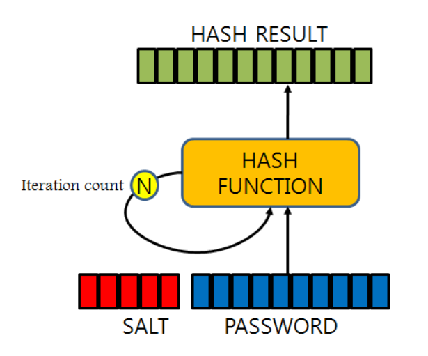

# salting & key stretching

많은 웹에서 회원의 비밀번호 암호화를 위해 사용되는 해시알고리즘에는 치명적인 단점이 있다. 그것은 같은 값에 대해 암호화한 암호문이 동일한 값을 가진다는 것이다.

만약 '12345'라는 문자열을 해시암호화할 경우 그 값은 항상 같은 값을 가진다. 물론 암호문은 문자들의 조합이 매우 복잡하게 되어 있지만 이미 특정 해시 암호문에 어떤 문자열을 가지는지 정리된 테이블이 존재한다.

* Rainbow Table Attack

`Rainbow Table`에는 특정 해시문이 어떤 문자열에 대응하는지 모두 정리되어 있다고 한다. 거기다 해시문은 원래에 암호문을 만들기 위한 목적이 아니라 짧은 시간에 데이터를 검색하기 위해 구현된 것이다.
처리속도가 매우 빨라 해킹하려고 하는 암호문을 대응하여 풀어내는데 그리 오랜시간이 걸리지 않는다. (MD5를 사용한 경우 일반적인 장비를 이용하여 1초당 56억 개의 다이제스트를 대입할 수 있다고 한다.)
그래서 이러한 보안 상에 약점을 보완하기 위해 탄생한 것이 `salting`과 `key stretching`이다.

## Salting

salting은 클라이언트가 입력한 패스워드에 임의의 숫자를 더하여 암호화 하는 방식이다. **'임의의 문자' + '입력된 패스워드'**인 것이다.

이렇게 되면 해커가 암호문을 대응하여 문자열을 찾아내었다해도 어떤 부분이 임의의 문자이고, 어떤 부분이 실제 패스워드인지 가려내기 쉽지 않다.

여기서 salting을 할 때는 서버단에는 임의로 부여한 문자를 저장해야 된다. 그렇지 않으면 정작 풀어야할 당사자도 풀 수 없을 수 있기 때문이다.

## Key stratching

key stratching은 일반적으로 암호화 과정이 한번 진행 되는 것을 여러번 진행 시키는 방식이다.

단순하게 생각하면 암호화된 문장을 n번 더 암호화하는 것이다. 한번만 암호화된 암호문의 경우 빠른 속도로 해석될 수 있지만, n번 암호화될 경우 해석속도가 급격하게 줄어든다.

해킹을 하려는 당사자의 컴퓨터 처리속도가 빠르면 더 빨리 해석이 될 수도 있지만, 이는 암호화 과정을 더해 대비할 수 있다.



## bcrypt

그렇다면 위와 같은 암호화 과정을 거치면 보안 측면에서 좋아진다는 것을 알았다. 그러면 위의 기능을 어떻게 구현할 것인지가 문제이다.

그런데 위의 두 가지 과정을 간단하게 구현해주는 코드가 이미 존재한다. `bcrypt`라는 것이다. 그러면 어떻게 구현하는지 예시를 보도록 하자.

```python
password = '1234'

bcrypt.hashpw(password.encode('etf-8'), bcrypt.gensalt())
```

위는 '1234'로 된 패스워드를 암호화하는 코드이다. 코드 중 `password.encode('etf-8')`은 유니코드를 utf-8형식으로 인코딩하는 것이다. 파이썬 3.x 이상에서 문자열은 유니코드 형식으로 되어 있다고 한다. 그런데 암호화를 하기위해서는 utf-8형식이 필요하므로 이를 인코딩한 것이다. 그리고 `bcrypt.gensalt()`로 salting을 적용시켜 암호화 하는 것이다.

위 코드를 적용시키면 일반적인 문자열이 복잡한 문자의 조합으로 재탄생하게 된다.
